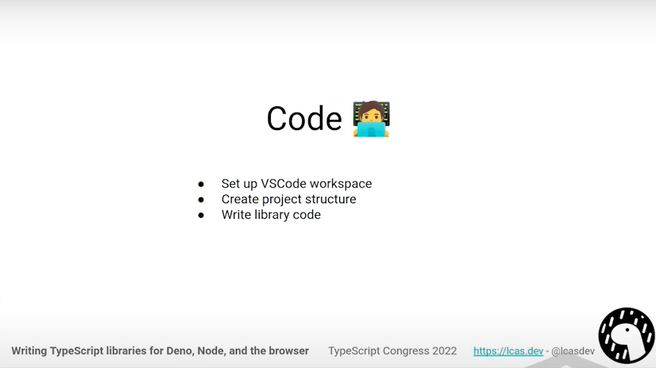

# XE Fullstack TypeScript with Deno

Con l'avvento di Blazor abbiamo visto che possiamo usare C# per scrivere anche
il frontend, e se volessimo fare lo stesso _(al contrario)_ con **TypeScript**?!

--

## Welcome to  [Deno](https://deno.land)!

**Daniele Morosinotto** [@dmorosinotto](https://twitter.com/dmorosinotto)

Repo:
[https://github.com/dmorosinotto/XE_Deno](https://github.com/dmorosinotto/XE_Deno)

--

# AGENDA by [ChatGPT](PREP_MATERIAL/chatGPT.md)

- **Introduzione a Deno**: cos'è e perché è stato creato
- **Confronto con Node.js**: differenze fondamentali e miglioramenti
- **Caratteristiche di Deno**: sicurezza, facilità d'uso, integrazione funzionalità Web
- Modalità di **esecuzione del codice** in Deno
- **Gestione delle dipendenze** e dei pacchetti in Deno
- **Esempi** di codice in Deno
- **Strumenti e librerie** disponibili in Deno + Integrazione _Node / NPM_
- Considerazioni sul **futuro di Deno** e sulla sua adozione
- Conclusione e **ulteriori risorse** per la formazione.

---

--

Eventuale approffondimento [History](PREP_MATERIAL/history/history.md) release...

--

Deno è stato presentato nel 2018 da **Ryan Dahl** _il papà di Node.js_! Vi consiglio di guardarvi il video per capire le motivazioni iniziali che l'anno spinto a iniziare Deno! 
[10 regrets of Node by Bryan 2018 the born of Deno](https://youtu.be/M3BM9TB-8yA)

--

--

Eventuale approffondimento sull'[architettura interna](PREP_MATERIAL/architecture/architecture.md) Rust...

--

--

--

--

--

--

--

--

--

--

--

--

Come impostare l'[ambiente di sviluppo](https://deno.land/manual@v1.30.3/getting_started/setup_your_environment) 
Io uso/vi suggerisco **VS Code** con l'[estensione x Deno](https://marketplace.visualstudio.com/items?itemName=denoland.vscode-deno) 

--

--

# DEMO

- [0](0-denoinit/README.md) `deno init`
- [1](1-helloworld/README.md) _Hello World!_ Webserver
- [2](2-staticfile/README.md) Uso dei _File_ + Servire **file Statici**
- [3](3-querystring/README.md) Uso della **QueryString** -> Prima logica Web 
- [4](4-restapi/README.md) **Rest API** utilizzando _deno.land/x/oak_
- [5](5-database/README.md) Utilizzo di un **database** + pacchetto _npm:mssql_
- [6](6-fullstack/README.md) Typescript **Fullstack** con applicazine [Angular](ngnew_latest/README.md)

---

## ADDOZIONE DI DENO

Anche molte aziende stanno iniziando a utilizzare Deno per lo sviluppo di applicazioni e servizi, 
il che dimostra la sua affidabilità e il suo potenziale a lungo termine dato che offre un ambiente di sviluppo _Moderno_!

Il futuro di Deno sembra molto promettente, grazie ad una Community attiva e un azienda Deno  
che sta lavorando per migliorare costantemente il runtime!
Vedi ultimi rilasci concentrati a semplificare **compatibilità con Node** e integrazione dei **Pacchetti npm** con la [ver 1.28](https://deno.land/manual@v1.30.3/node/npm_specifiers) di novembre 2022

--

## PRESPETTIVE FUTURE

Riferimento ad [articolo](https://tinyclouds.org/javascript_containers) e visione di [Ryan Dahl podcast](https://podrocket.logrocket.com/deno) 
sul fatto di non avere più bisogno di _Container Doker_ per far girare Deno, ma avere direttamente **Javascript Container** 
ossia direttamente **istanze del Runtime** come _"aprire una Tab in the cloud"_

-   `Deno deploy` [offerta commerciale](https://deno.com/deploy/pricing) Deno Company:  Github CI/CD -> Deno to the EDGE in 5sec
-   Lavoro della fondation [WinterCG](https://wintercg.org) con Cloudflare per standardizzare le funzionalità del Runtime distribuito to the Edge

## EXTRA: PUBBLICAZIONE LIB deno.land/x + npm!

--

--

---

## Q&A + REFERENCE

- [10 regrets of Node](https://youtu.be/M3BM9TB-8yA) by Ryan Dahl 2018 the born of Deno 
- [What’s deno](https://youtu.be/dzfW7Q57O8E) by Ryan Dahl
- [Deno dream stack](https://youtu.be/3NR9Spj0DmQ) by Ryan Dahl bel talk su deno deploy
- [Podcast with Ryan Dahl](https://podrocket.logrocket.com/deno) visione su futuro ["Javascript container"](https://tinyclouds.org/javascript_containers) / deno deploy
- [Deno 101 intro](https://youtu.be/qXV6aL0-7n4) talk by Luca Casonato 
- [State of deno 2022](https://youtu.be/IaSq3pxZtn0) compatibilità npm
- [Intro course 20min](https://youtu.be/Bkzem7vLjlA) introduzione a Deno 
- [Deno crash course 1h](https://youtu.be/NHHhiqwcfRM) intro -> full Rest API example 
- [Intro to Deno for Node.js dev](https://youtu.be/Jqh9wpi3ME0) mostra timeline Deno e architettura interna Rust+V8 
- [Scrivere Lib x TS / deno e browser](https://youtu.be/91sGi9Gkxjg) bello mostra DNT
- [Deno by Examples](https://examples.deno.land) esempi codice commentati
- [Deno Examples](https://deno.land/manual@v1.30.0/examples) nel Manuale - documentazione ufficiale
- [Deno News 1.28](https://deno.news/archive/54-npm-compatibility-is-stabilized-in-128) stabilize npm:specifier 
- [Rilascio Deno 1.29](https://deno.com/blog/v1.29) novità REPL 
- [Deno 1.30 Release note](https://deno.com/blog/v1.30) aggiunto moduli builtin Node.js node:xxx 
- [Deno office hours Q&A](https://deno.com/blog/office-hours-transcript-2023-01-13) latest 2023-01-13
- [Deno to the EDGE](https://youtu.be/G_2AgdgEbkI) e uso deno deploy
- [Deno su docker](https://youtu.be/pmqvGHaRXUM) + deploy su cloud
- [Deno workshop 2h](https://youtu.be/7OrJP_EeX4s) su come usare Fresh SSR + [javascript islands](https://deno.com/blog/back-to-the-ssr) isomorfico in Deno
- [Deno + Vite](https://youtu.be/MRDV6O7YAtQ) bel video da provare [fullstack con Vue](https://deno.land/manual@v1.30.3/node/how_to_with_npm/vue)
- [Esempio uso Prisma + API Oak](https://deno.land/manual@v1.30.3/node/how_to_with_npm/prisma) per accesso DB Postgress + API crud in Oak 
- [Guida Prisma per Deno deploy](https://www.prisma.io/docs/guides/deployment/deployment-guides/deploying-to-deno-deploy)
- [GraphQL in Deno](https://deno.com/blog/build-a-graphql-server-with-deno) Articolo su come creare server GraphQL
- [Come fare scription/CLI](https://matklad.github.io/2023/02/12/a-love-letter-to-deno.html) sfruttando Deno 

### EXTRA:
- [Utilizzo di ZOD](https://www.totaltypescript.com/tutorials/zod) x validazione in TS
- [Esempio ZOD + NG](https://timdeschryver.dev/blog/get-easy-access-to-angular-route-and-query-parameters-with-zod) mostra come fare coerce QS/Params
- [Esemppio API CRUD + JWT](https://github.com/22mahmoud/deno_crud_jwt) Repo su Github
- [ChatGPT in Supabase](https://supabase.com/blog/openai-embeddings-postgres-vector) articolo che mostra come fare risposte "tipo ChatGPT" usando Supabase + functions su deno deploy
- [Polyscale](https://youtu.be/F505n0d9iuA) servizio cache distribuita x Postgres/Supabase x ottimizzare accesso dati on the Edge
- [tRPC](https://trpc.io/docs/) fullstack API typesafe con TS 
- [tRPC + Prisma](https://noahflk.com/blog/supabase-typescript-trpc/) Articolo su come usarlo su Supabase 
- [Esempio tRPC + NG](https://angularexperts.io/blog/angular-trpc) come usare tRPC serverside (in falstify) + ZOD per validazione <-> clienside in Angular  
- [Esempio tRPC + ZOD](https://github.com/trpc/trpc/tree/main/examples/deno-deploy) per adapter fetch che permette di usare tRPC + zod su progetto Deno deploy 
- [Deep-dive su TS module resolution](https://youtu.be/MEl2R7mEAP8) + Bella discussione su come usare NPM qualche [weird case CommonJS](https://youtu.be/eRs_MGdCXGU) 
- [Sito https://publint.dev](https://publint.dev) per testare se package.json è fatto bene (pubblicato come ESM) 
- [Video su Deno FFI](https://youtu.be/9f9Ujeods5o) chiamate a funzioni esterne C++/Rust 
- [Video](https://www.youtube.com/live/-8L3_OOeENo?feature=share) + [Articolo](https://github.com/denoland/roll-your-own-javascript-runtime) che mostra come farsi *runtimeJs in Rust* a partire dai crate di Deno   
- [Creare WASM <- da Rust](https://surma.dev/things/rust-to-webassembly/) come compilare Rust -> WASM
- [Redis in WASM](https://github.com/WasmEdge/wasmedge-db-examples/tree/main/redis) Come usare Redis client compilato in WASM (solo 700Kb) 

---

## FEEDBACK & CONTACT

#### Daniele Morosinotto

**Javascript enthusiast**

- Twitter [@dmorosinotto](https://twitter.com/dmorosinotto)
- Email [d.morosinotto@icloud.com](d.morosinotto@icloud.com)
- Repo [https://github.com/dmorosinotto/XE_Deno](https://github.com/dmorosinotto/XE_Deno)
