# XE Fullstack TypeScript with Deno

Con l'avvento di Blazor abbiamo visto che possiamo usare C# per scrivere anche il frontend, e se volessimo fare lo stesso _(al contrario)_ con **TypeScript**?!

--

## Welcome to  [Deno](https://deno.land)!

**Daniele Morosinotto**
[@dmorosinotto](https://twitter.com/dmorosinotto)

Repo: [https://github.com/dmorosinotto/XE_Deno](https://github.com/dmorosinotto/XE_Deno)

--

# AGENDA by [ChatGPT](chatGPT.md)

-   **Introduzione a Deno**: cos'è e perché è stato creato
-   **Confronto con Node.js**: differenze fondamentali e miglioramenti
-   **Caratteristiche di Deno**: sicurezza, facilità d'uso, integrazione funzionalità Web
-   Modalità di **esecuzione del codice** in Deno
-   **Gestione delle dipendenze** e dei pacchetti in Deno
-   **Esempi** di codice in Deno
-   **Strumenti e librerie** disponibili in Deno + Integrazione _Node / NPM_
-   Considerazioni sul **futuro di Deno** e sulla sua adozione
-   Conclusione e **ulteriori risorse** per la formazione.

--

# 1. INTRO A DENO

## Cos'è e perché è stato creato

-   Presentare Deno come un runtime JavaScript e TypeScript open source basato sul server
-   Sottolineare che è stato sviluppato da Ryan Dahl, il creatore di Node.js
-   Spiegare che è stato creato per risolvere alcuni dei problemi che si sono verificati con Node.js

--

Deno è un runtime JavaScript e TypeScript open source basato sul server, sviluppato da Ryan Dahl, il creatore di Node.js. È stato lanciato nel maggio 2020 ed è caratterizzato da una maggiore sicurezza, una maggiore facilità d'uso e una maggiore integrazione delle funzionalità rispetto a Node.js.

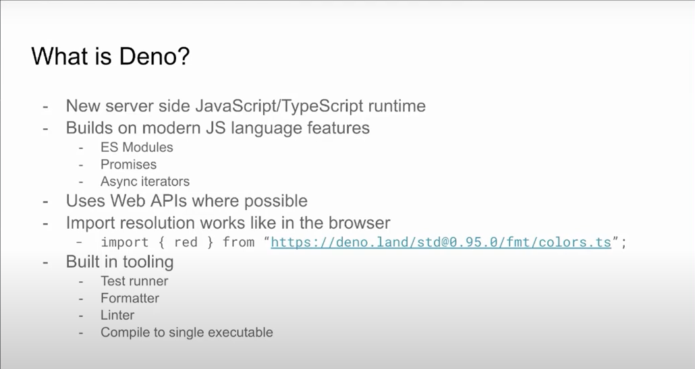
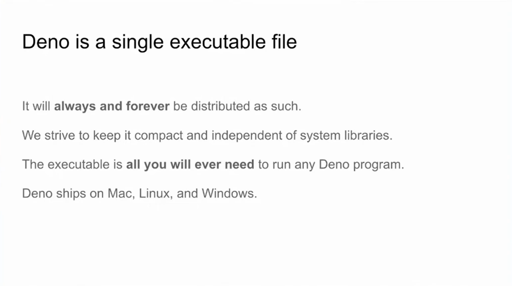

--

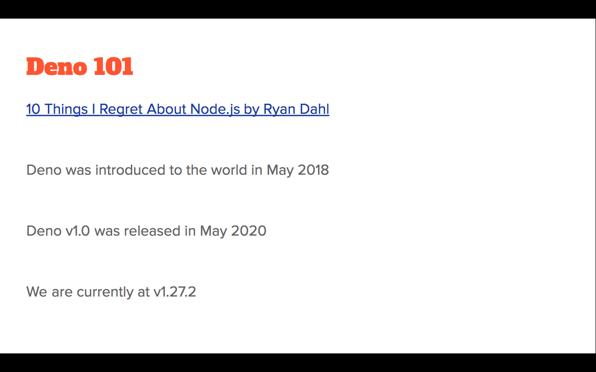
[Storia Versioni](history/history.md)

---

# 2. DENO vs NODE.JS

Confronto con Node.js: differenze fondamentali e miglioramenti

-   Mostrare le principali differenze tra Deno e Node.js
-   Solo ESModule, run url, deps, importmap, typescript OOTBox
-   Sottolineare i miglioramenti apportati da Deno rispetto a Node.js come ad esempio la facilità d'uso: Typescript , run url, gestione dipendenze, sicurezza, integrazione funzionalità/tool...

--

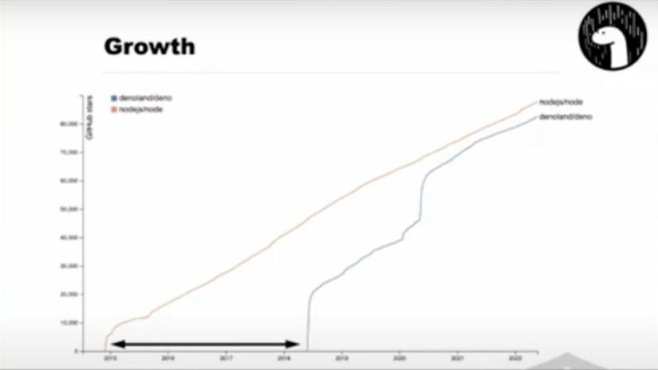

[Architectura RUST+V8](architecture/architecture.md)

--

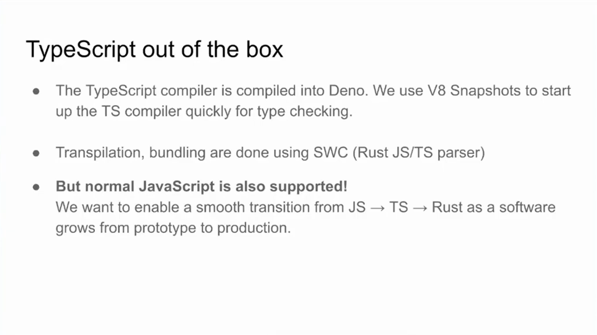

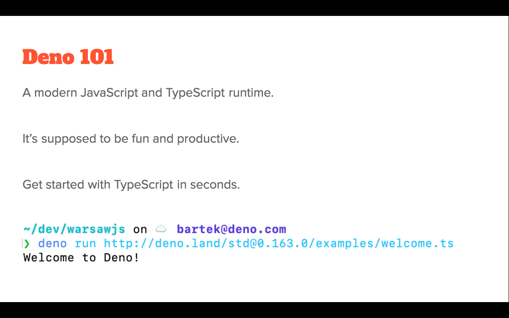

---

# 3. CARATTERISTICHE DENO

Caratteristiche di Deno: sicurezza, facilità d'uso, integrazione delle funzionalità

-   Approfondire le caratteristiche di Deno, come ad esempio la sicurezza integrata, la modalità di esecuzione del codice e la gestione delle dipendenze
-   Sottolineare la facilità d'uso di Deno, come ad esempio la possibilità di eseguire codice direttamente dal terminale senza la necessità di installare pacchetti o gestire la configurazione
-   Discutere l'integrazione delle funzionalità di Deno, come ad esempio la capacità di eseguire sia JavaScript che TypeScript
-   Aderenza a _Web Standard_

--

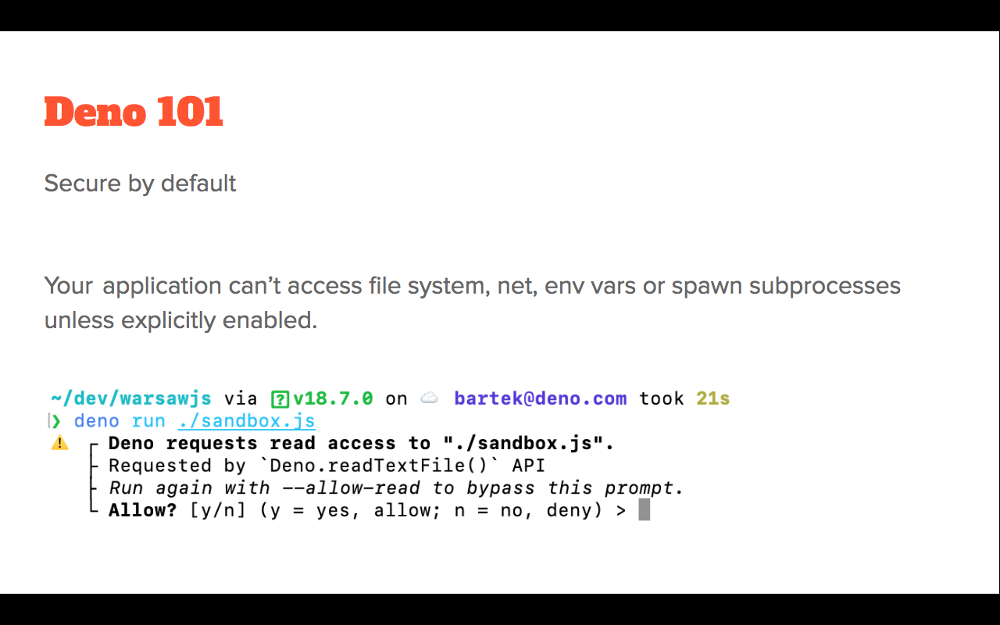

--

# 4. RUN CODE WITH DENO

Modalità di esecuzione del codice in Deno

-   Mostrare come eseguire codice in Deno direttamente dal terminale
-   Discutere le opzioni disponibili per l'esecuzione di codice, come ad esempio l'esecuzione di file o l'esecuzione di codice in repl o direttamente da url

--

---

# 5. MODULE SYSTEM

Gestione delle dipendenze e dei pacchetti in Deno

-   Discutere come gestire le dipendenze in Deno, ad esempio tramite URL
-   Sottolineare che non esiste un registro centrale come NPM per i pacchetti

--

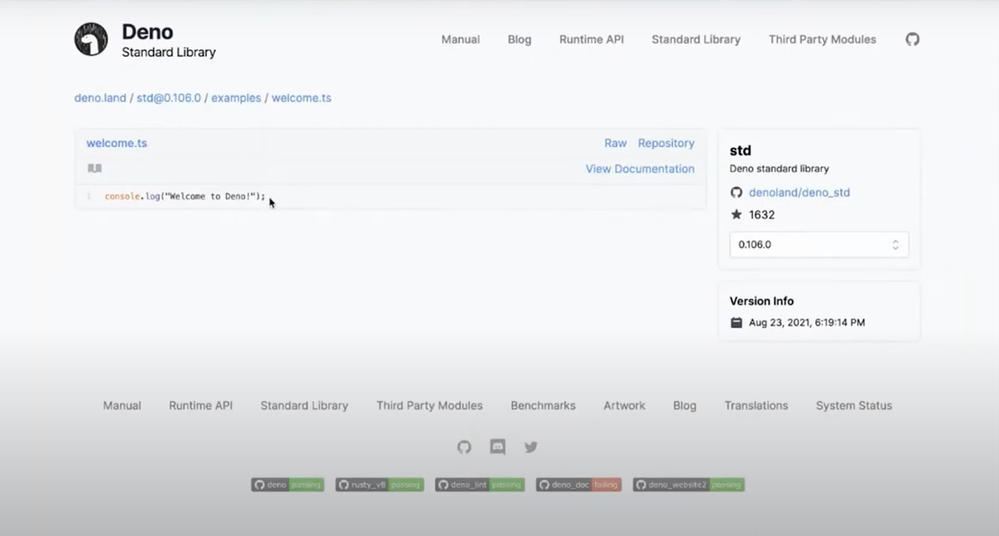
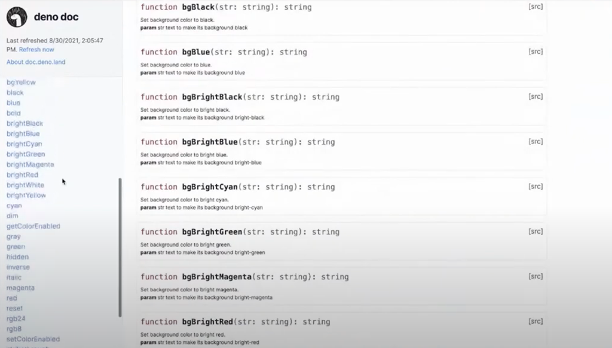
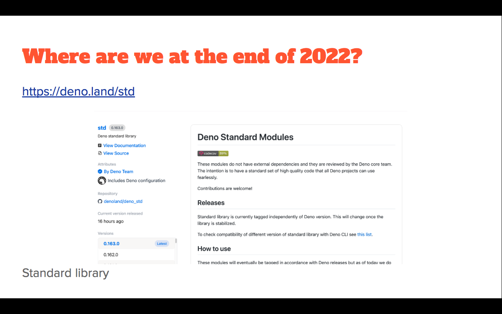
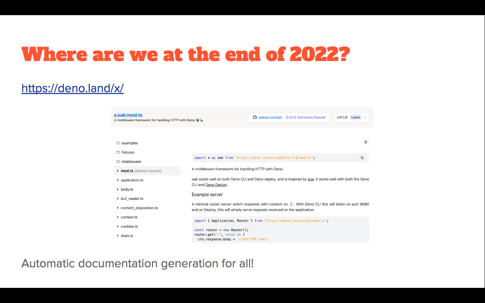

---

# 6. DEMO ESEMPI

Esempi di codice in Deno

-   Mostrare alcuni esempi di codice Deno per mostrare come utilizzare le funzionalità di base
-   Discutere i casi d'uso più comuni per Deno, come ad esempio lo sviluppo di API e la creazione di tool per la riga di comando

--

> Per una sessione di introduzione a Deno, potresti considerare di presentare i seguenti esempi di codice:

-   Hello World: Un semplice esempio per mostrare come stampare "Hello World" in Deno utilizzando la funzione console.log().
-   Server HTTP: Mostrare come creare un semplice server HTTP in Deno utilizzando la libreria built-in "http".
-   Lettura di un file: Mostrare come leggere il contenuto di un file in Deno utilizzando la funzione Deno.readFile().
-   Script di utilizzo comune: Mostrare come eseguire uno script Deno come programma da riga di comando.
-   Lavorare con le API: Mostrare come effettuare richieste HTTP a un'API esterna e recuperare i dati in Deno.

-   Programmazione asincrona: Mostrare come utilizzare le funzionalità di programmazione asincrona di Deno, come le promesse e i gestori di coroutine, per creare applicazioni efficienti.

> Questi esempi possono fornirti una base per comprendere le principali funzionalità di Deno e come utilizzarle per sviluppare applicazioni.

---

# 7. DENO CLI & STD LIBS + NPM

Strumenti e librerie disponibili in Deno

-   Mostrare gli strumenti e le librerie disponibili per Deno, come ad esempio le librerie per l'elaborazione di file CSV e JSON
-   Mostrare utilizzo WEB Standards
-   Discutere come questi strumenti e librerie possono aiutare nello sviluppo (vedi Oak)
-   Integrazione _NPM_ e _Node standard_

--

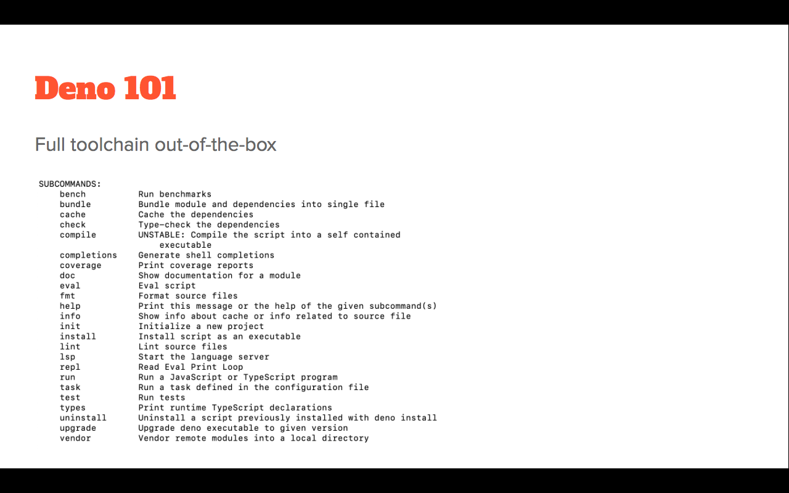
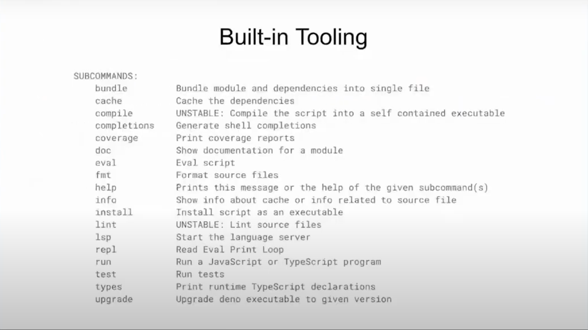

--

--

--

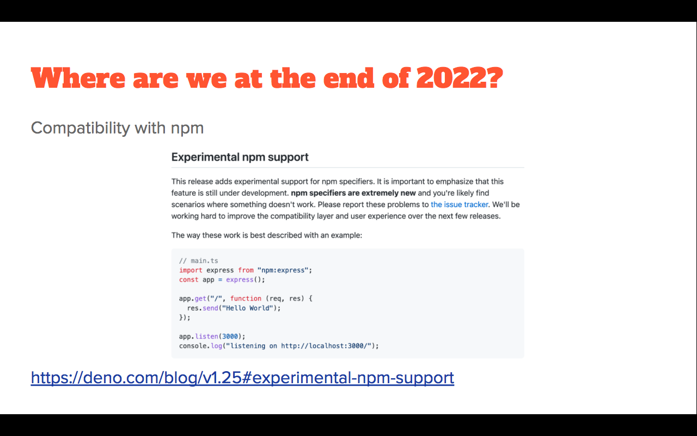
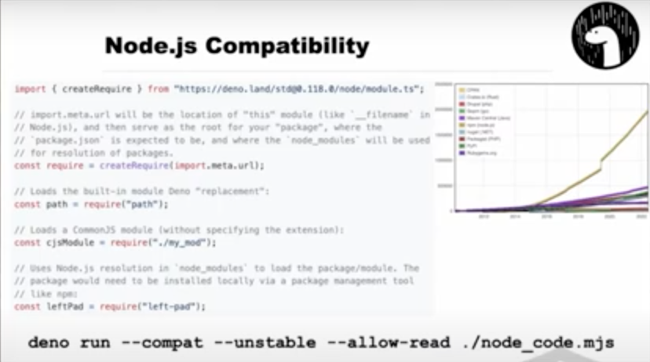

---

# 8. FUTURE OF DENO

Considerazioni sul futuro di Deno e sulla sua adozione

-   Discutere la crescita della comunità e l'adozione di Deno da parte di sviluppatori e aziende
-   Fare una previsione sul futuro di Deno e sul suo ruolo all'interno dell'ecosistema JavaScript e TypeScript
-   Idea _Javascript Container_ -> deno deploy

## Adozione di Deno da parte delle aziende

Anche molte aziende stanno iniziando a utilizzare Deno per lo sviluppo di applicazioni e servizi, il che dimostra la sua affidabilità e il suo potenziale a lungo termine

--

## Prospettive future di Deno
Il futuro di Deno sembra molto promettente, con una comunità attiva e in crescita che sta lavorando per migliorare ulteriormente il runtime.
Vedi ultimi rilasci concentrati a semplificare **compatibilità con Node** e integrazione **pacchetti npm**

--

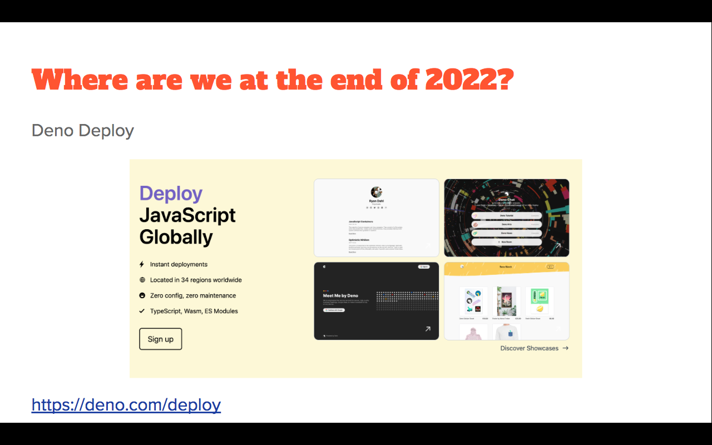
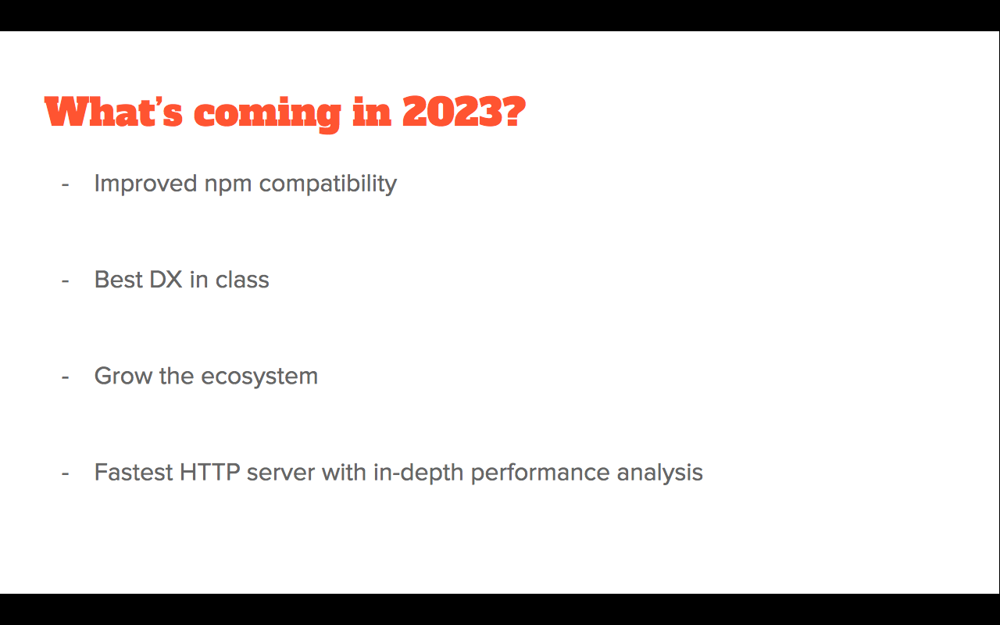

## Idea: Javascript Container

Riferimento ad [articolo](https://tinyclouds.org/javascript_containers) e visione di Ryan Dahl sul fatto di non avere più bisogno di _Container Doker_ per far girare Deno, ma avere direttamente **Javascript Container** ossia direttamente **istanze del Runtime** come _"aprire una Tab in the cloud"_

-   `Deno deploy` [offerta commerciale](https://deno.com/deploy/pricing) Deno Company:  Github CI/CD -> Deno to the EDGE in 5sec
-   Lavoro della fondation [WinterCG](https://wintercg.org) con Cloudflare per standardizzare le funzionalità del Runtime distribuito to the Edge

---

# 9. CONCLUSION

Conclusione e ulteriori risorse per la formazione

-   Riepilogare i punti principali della presentazione
-   Fornire risorse utili per ulteriori approfondimenti su Deno, come documentazione ufficiale, tutorial e video

Aprire la sessione a domande e rispondere a qualsiasi domanda su Deno.

## Q&A + REFERENCE

Bellissimo video/esempi base Learn Deno in 20min https://youtu.be/Bkzem7vLjlA bello intro basato su esempi con introduzione permission passo passo
State deno 2022 Npm compat https://youtu.be/IaSq3pxZtn0 bello mostra intro concetti + api base + run + uso npm module + mod.ts + import map + deno cache lock
Slides https://tinyurl.com/state-of-deno-2022
Deno su docker + deploy in cloud https://youtu.be/pmqvGHaRXUM
Deno by Examples (spunti x esempi/how to con code e commentato) https://examples.deno.land
Deno to the EDGE https://youtu.be/G_2AgdgEbkI
Ritrovare Talk. Deno 101 intro by LUcA Casonato https://youtu.be/qXV6aL0-7n4
What’s deno by Brian Dahl https://youtu.be/dzfW7Q57O8E
Scrivere Lib x TS / deno e browser https://youtu.be/91sGi9Gkxjg bello mostra DNT dal min17 x esportare codice TS deno -> node (compila CJS + ESM da provare se vain browser)
Intro to Deno for Node.js dev https://youtu.be/Jqh9wpi3ME0 bello mostra timeline deno e architettura interna rust+v8 + deno CLI e deno std / deno vendor
Deno NEWS online https://deno.news/archive/54-npm-compatibility-is-stabilized-in-128
Podcast Deno by Bian Dahl https://podrocket.logrocket.com/deno
Rilascio Deno 1.29 novità REPL https://deno.com/blog/v1.29
Utilizzo di ZOD x validazione https://www.totaltypescript.com/tutorials/zod
Extra articolo su Supabase + prisma + trpc https://noahflk.com/blog/supabase-typescript-trpc/
Figata tRPC fullstack API typesafe con TS https://trpc.io/docs/
Deno to the EDGE (deno deploy). https://youtu.be/G_2AgdgEbkI
Video su Deno FFI chiamate a func C++/Rust https://youtu.be/9f9Ujeods5o
Articolo su come creare server GraphQL in Deno https://deno.com/blog/build-a-graphql-server-with-deno
Deno latest news office hour q&a https://deno.com/blog/office-hours-transcript-2023-01-13
DENO 1.30 RELEASE NOTE (aggiunto builtin moduli Node.js) https://deno.com/blog/v1.30
10 regrets of Node by Bryan 2018 the born of Deno https://youtu.be/M3BM9TB-8yA
What is Deno by Ryan 50min 2021 https://youtu.be/dzfW7Q57O8E
Deno crash course 1h intro -> full Rest api example https://youtu.be/NHHhiqwcfRM
Deno workshop 2h su come usare Fresh (SSR) https://youtu.be/7OrJP_EeX4s + articolo su SSR evoluzione storica e come fare JS island isomorfico in Deno https://deno.com/blog/back-to-the-ssr
Visione Ryan Dahl su futuro Deno podcast: https://changelog.com/jsparty/256 / container https://tinyclouds.org/javascript_containers / deno deploy
DEEP-DIVE su TS module resolution veramente na merda senza DENO https://youtu.be/MEl2R7mEAP8
Bellissimo talk su deno deploy + dream stack by Ryan https://youtu.be/3NR9Spj0DmQ
Deno + Vite bel video da provare https://youtu.be/MRDV6O7YAtQ
Esempio come usare tRPC serverside (in falstify) + ZOD per validazione <-> clienside in Angular https://angularexperts.io/blog/angular-trpc + documentazione tRPC per usare adapter fetch che permette di usare tRPC + zod su progetto Deno deploy https://trpc.io/docs/fetch repo esempio https://github.com/trpc/trpc/tree/main/examples/deno-deploy
Bella serie di Esempi uso DENO commentati e provabili come url (potrei usarne alcuni x le DEMO) https://examples.deno.land oppure anche questi vanno bene https://deno.land/manual@v1.30.0/examples
Modo per limitare CPU usate in .NET CORE https://learn.microsoft.com/en-us/dotnet/framework/configure-apps/file-schema/runtime/thread-useallcpugroups-element

---

## FEEDBACK & CONTACT

#### Daniele Morosinotto

**Javascript enthusiast**

-   Twitter [@dmorosinotto](https://twitter.com/dmorosinotto)
-   Email [d.morosinotto@icloud.com](d.morosinotto@icloud.com)
-   Repo [https://github.com/dmorosinotto/XE_Deno](https://github.com/dmorosinotto/XE_Deno)
